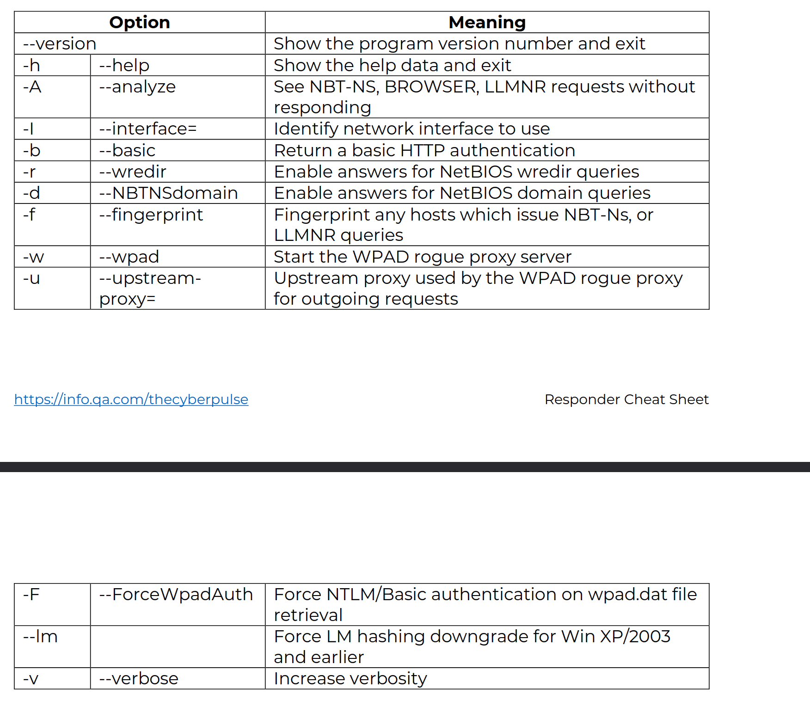
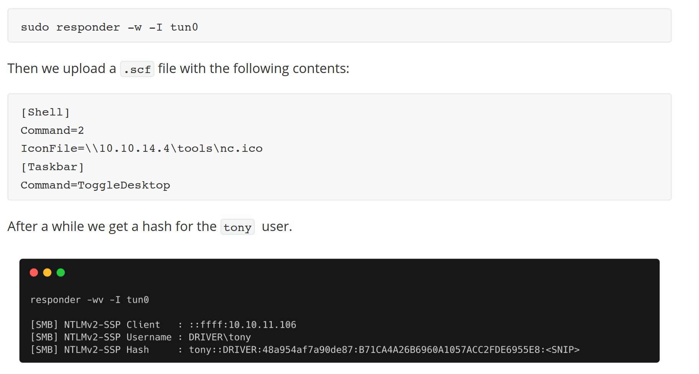

Responder is a LLMNR, NBT-NS and mDNS poisoning tool
which provides spoof answers to specific network queries

SMB, HTTP, and HTTPS are the most common protocols that are vulnerable to this attack

